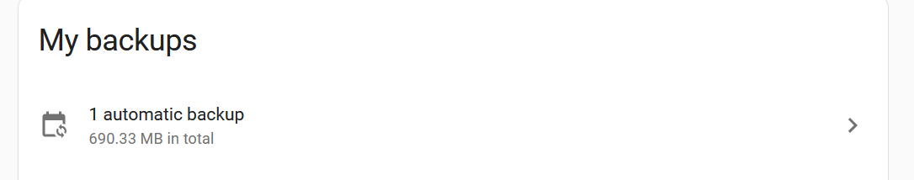
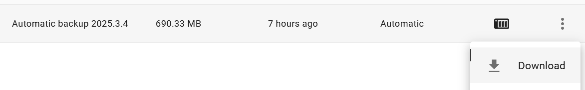
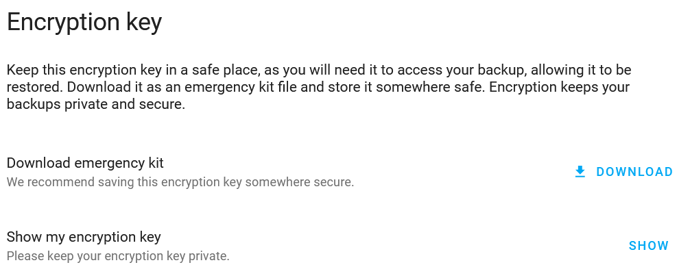

# Home Assistant Backup Decryption Tool
## Intro
Since recent versions of Home Assistant, Backups are greatly imporved, automated and securely encrypted.
However, if, as an advanced user you wish to extract data from  these backup files, there is no simple way to do so.

This tool is  here to help you with data extraction.

## Input Files
What you will need : 
- one (or more) Automated Backup file
- your encryption key, or the backup emergency kit file

### Automated Backup file
To download this file you will have to :
- Go to your Home Assistant installation
- Then Navigate to `Settings->System->Backups`
- Select the Automated Backups list :

- Finally, use the '...'  menu to download the file you require


### Encryption Key
To get your encryption key, either you have (RECOMMENDED) stored it somewhere safe or :
- Go to your Home Assistant installation
- Then Navigate to `Settings->System->Backups->CONFIGURE BACKUP SETTINGS`
- Scroll down and you will find :

- From here either :
  - Use `Download emergency kit` to download your backup encryption emergency kit
  - use `Show my encryption key` to copy it and use it as is


## Run the Decryption tool
First you need to prepare your data :
Create data directories and copy files :
```
mkdir -p ./input ./output
cp Automatic_backup.*.tar ./input/
cp home_assistant_backup_emergency_kit*txt ./input/
```

### Directly from your terminal
- Get the this repository :
```
https://github.com/acaranta/home_assistant_backup_decryption.git
cd home_assistant_backup_decryption
```
- Install needed env/modules :
```
python3 -m venv .venv
source .venv/bin/activate
pip3 install -r requirements.txt
```
- Run the script :
```
./hass_backup_decrypt.py -i ./input -o ./output
```

### Using docker image
- You may build the image yourself :
```
docker build -t acaranta/home_assistant_backup_decryption .
```
- Or use the image built from this repository : [acaranta/home_assistant_backup_decryption](https://hub.docker.com/r/acaranta/home_assistant_backup_decryption)
- Then Run the image :
```
docker run --rm -ti \
    -v $(pwd)/input:/input:ro \
    -v $(pwd)/output:/output \
    --user=$(id -u):$(id -g) \
    acaranta/home_assistant_backup_decryption
```


## Help and Options
The script has several options available that you can review using 
```
./hass_backup_decrypt.py --help
# or
docker run --rm -ti acaranta/home_assistant_backup_decryption --help

🏠 Home Assistant Backup Decryption Tool
=======================================
usage: hass_backup_decrypt.py [-h] [-i INPUT] [-o OUTPUT] [-k KEY]

Home Assistant Backup Decryption Tool

options:
  -h, --help            show this help message and exit
  -i INPUT, --input INPUT
                        Input directory containing backup files (default: /input)
  -o OUTPUT, --output OUTPUT
                        Output directory for decrypted files (default: /output)
  -k KEY, --key KEY     Encryption key (Format XXXX-XXXX-XXXX-XXXX-XXXX-XXXX-XXXX)
```

NB : if the emergency kit is not found, and if you do not provide the encryption key as an option, you will be prompted to manually input it.

## References :
The script idea comes from the script developped by [cogneato](https://github.com/cogneato/ha-decrypt-backup-tool) (idea and some part of the code).
But using as close as possible the same logic and modules (like [securetar](https://pypi.org/project/securetar/)) and keep as close as possible to the decryption methods used in [HA itself](https://github.com/home-assistant/core/blob/2121b943a32ebcbce7acb377cbf44c41d1805381/homeassistant/backup_restore.py#L92).